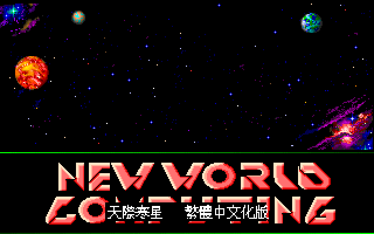
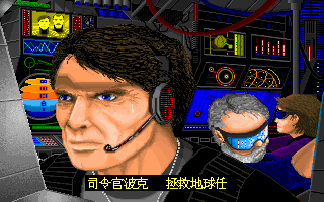
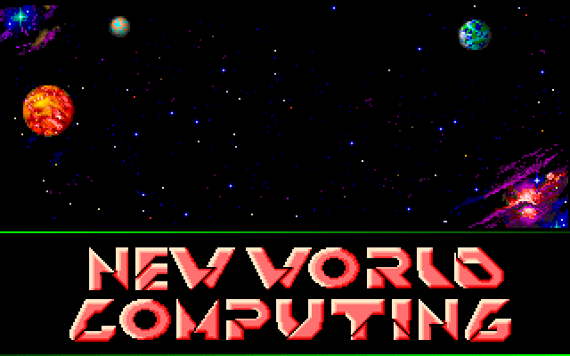
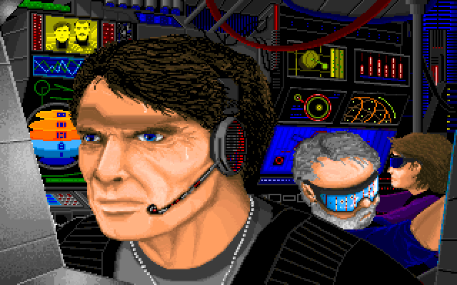
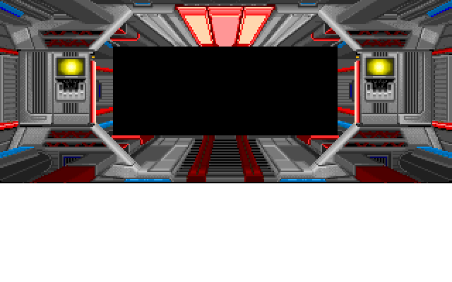
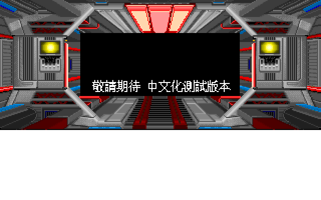

# Planet's Edge 繁體中文化專案

> *Planet's Edge: The Point of No Return*（1992 New World Computing）
> — 完整繁體中文化  
> 1191 條字串翻譯 ✦ SDL2 C++17 native port ✦ 12×12 Big5 點陣黑體

---

## 目錄

1. [一句話說清楚](#hero)
2. [快速開始](#quick-start)
3. [為何要漢化 Planet's Edge？](#why)
4. [New World Computing 1990–1992 黃金期](#nwc-golden)
5. [Planet's Edge 世界設定](#world)
6. [螢幕截圖展示](#screenshots)
7. [1990 年代台灣太空遊戲玩家](#pioneers)
8. [Technical Deep Dive](#technical-deep-dive)
9. [Acknowledgments / 致謝](#credits)
10. [License](#license)

---

<a name="hero"></a>
## 🚀 Planet's Edge 繁體中文版 — 以母語踏上半人馬星區



*「天際寒星 — 繁體中文化版」開場 logo，原 NWC 1992 splash 加上繁體中文字幕*

這是 **Planet's Edge: The Point of No Return（1992）** 的完整繁體中文化專案。

| 項目 | 狀態 |
|------|------|
| Land.exe UI 字串 | **212 / 212** ✅ |
| Pe.exe UI 字串 | **54 / 54** ✅ |
| Space.EXE UI 字串 | **393 / 393** ✅ |
| Objects.bch 物品 | 進行中（252 條）|
| Spacet.bch 行星掃描 | 進行中（223 條）|
| 1.bch / 2.bch 章節事件 | 進行中（57 條）|
| 平台 | **SDL2 C++17 native（Linux / Win / macOS）** |
| 字型 | 12×12 Big5 點陣黑體（自繪，源自 GNU Unifont OR-downsample） |
| 字串池 | en + zh 雙欄 TSV（CC BY-SA 4.0） |
| GitHub | [wicanr2/planets_edge_cht](https://github.com/wicanr2/planets_edge_cht) |

---

<a name="quick-start"></a>
## ⚡ 快速開始

### 你需要準備

- **正版 Planet's Edge 原版資料**（自行取得合法拷貝；本 repo 不附遊戲檔）
- **SDL2 2.0+**（Linux: `libsdl2-2.0-0` / Windows: bundled with release）
- **pe-cht native binary**（從 [Releases](https://github.com/wicanr2/planets_edge_cht/releases) 下載，或從 source build）

### 三步啟動（規劃中，待 SDL2 port 完成）

```bash
# 1. 取得本 repo
git clone https://github.com/wicanr2/planets_edge_cht.git
cd planets_edge_cht/sdl2_engine

# 2. Build (Linux)
./build_cpp.sh           # → build_cpp/pe_intro_viewer
# or cross-build Windows:
./build_win.sh           # → win_package/pe_intro_viewer.exe

# 3. 指向你的原版 PE 資料夾啟動
./build_cpp/pe_intro_viewer /path/to/your/PE/Intro.cc \
    --frame-id 4413 --palette-id EBC8 \
    --font big5_font_12.bin --subtitle nwc
```

啟動後 SDL2 視窗開啟，繁體中文 UI 取代原版英文：


*「司令官波克 - 拯救地球任務」— Commander Mason Polk 角色介紹畫面*

---

<a name="why"></a>
## ✨ 為何要漢化 Planet's Edge？

1992 年，**New World Computing**（魔法門系列創始公司）做了一件當時 RPG 圈不敢做的事——
**把劍與魔法的世界整個搬到太空**。

主角不再是劍士、法師、僧侶，而是 **NASA / U.N.F.A. 派出的星際探勘小隊**。
故事不再是「打敗黑暗魔王」，而是 **拼湊一個一千年前神祕外星裝置的八個零件**，
拯救一艘正以光速衝向地球的核子末日船。

> *「我們已盡力為你們做好準備。八個零件散落宇宙各處——它們可能毫無價值，
> 但也可能拯救整個地球。願好運與你同在，司令官。」*  
> — Commander Mason Polk briefing，1992

這是電玩史上少數**正面挑戰 Columbian 探險敘事**的遊戲：你不是侵略者，
你是**最後一個有機會的人類**，要在一個極可能不歡迎你的星區，
跟卵生族 (Spawn)、辛賽人 (Cin Sae)、聯合星際艦隊 U.N.F.A. 各種勢力協商生存。

**三十四年後**，這個專案想做的事很簡單：讓 2026 年的中文玩家，
能以母語讀到 Polk 司令官在月球基地的 briefing、Iolo 風格的隊友吐槽
「他死了，吉姆！」（致敬 Star Trek），以及那些**從未在英文外的語言裡存在過**的星圖座標。

---

<a name="nwc-golden"></a>
## 📜 New World Computing 1990–1992 黃金期

要理解 Planet's Edge，先了解 NWC 那段創作高峰。

| 年份 | 作品 | 設計者 | 意義 |
|------|------|--------|------|
| 1986 | Might and Magic I | Jon Van Caneghem | NWC 第一代 |
| 1988 | Might and Magic II | JVC + Mark Caldwell | TBS combat 確立 |
| 1991 | **Might and Magic III** | JVC + 大團隊 | VGA + 全圖形化革命 ✦ |
| 1992 | **Planet's Edge** | William R. Dean + Joseph B. Hewitt | **NWC 第一個 sci-fi RPG** ⭐ |
| 1992 | King's Bounty (NWC publishing) | Jon Van Caneghem | HoMM 前身 |
| 1993 | Might and Magic IV: Clouds of Xeen | NWC | 連體雙 RPG 雛形 |
| 1995 | Heroes of Might and Magic | NWC | TBS 黃金時代開啟 |

Planet's Edge **不是 MM 系列的太空版**——它是 NWC 內部一個獨立小團隊的實驗作。
William R. Dean（後來去 3DO 做 Might and Magic VIII）的個人設計風格貫穿全作：
**強敘事 + 程序產生星圖 + 隊伍管理 + 戰術回合制戰鬥**。

它沒成為續作 IP，但它的 **8-元件 mission goal 結構**直接影響了三年後的
*Star Control 2* 與 *Privateer*。

---

<a name="world"></a>
## 🌌 Planet's Edge 世界設定

### 八個元件 — 拯救地球的鑰匙

```
M.I.C.T.U.  Algocar  K-bean  Harmonic Resonator
                    │
                    ▼
                Centauri Device  →  封住核子末日船
                    ▲
                    │
Mass Converter  Gravitic Compressor  Krupp Shields  Algiebian Crystals
```

每個元件散落於半人馬星區（Sector Kornephoros 為首）的某個星系。
玩家要：

1. 從月球基地起飛（Commander Polk briefing 完）
2. 在 Star Map 上挑下一個星系跳躍 (Tele-trans)
3. 著陸 (Land.exe) 探索 / 戰鬥 / 蒐證
4. 太空中遇敵則進入 Space combat (Space.EXE)
5. 找齊 8 元件 → 組成 Centauri Device → 通關

### 重要外星種族

| 種族 | 特性 | 譯名 |
|------|------|------|
| **Spawn** | 卵生族；體外受精、群體意識 | 卵生族 |
| **Cin Sae** | 辛賽人；商業文明、樂於交易 | 辛賽人 |
| **U.N.F.A.** | United Nations Federation of Astronauts；人類聯邦 | 聯合星際艦隊 |

### Star Trek 致敬

PE 的劇本對 Star Trek 有大量梗：

- 隊友死亡訊息：`He's dead jim!` → 「他死了，吉姆！」（McCoy 經典台詞）
- 跳躍傳送：`Tele-Trans activated` → 「跳躍傳送啟動」（致敬 transporter）
- 隊伍配置：醫護兵 + 工程師 + 駕駛員 + 隊長

---

<a name="screenshots"></a>
## 📸 螢幕截圖展示

### 原版 vs 繁中版對照

| 原版（英文） | 繁中版 |
|---|---|
|  |  |
| NWC 1992 splash logo | + 「天際寒星 繁體中文化版」字幕 |
|  |  |
| Commander Polk briefing | + 「司令官波克 拯救地球任務」字幕 |
|  |  |
| 太空船內 viewport | + 「敬請期待 中文化測試版本」於 viewport 黑色字幕區 |

全部圖片皆 **SDL2 native 渲染**（無 DOSBox），320×200 mode-13h 模擬，2x 縮放 = 640×400 視窗。

---

<a name="pioneers"></a>
## 🎮 1990 年代台灣太空遊戲玩家

1992 年那時候台灣沒有 Steam、沒有 Discord、沒有 GOG。
*Planet's Edge* 在台灣是**完全沒中文化、沒攻略本、沒中文雜誌專欄**的一款 NWC 作品。

當時懂英文又願意啃這款的玩家，全憑：
- 微電腦傳真 / 軟體世界 雜誌的破爛截圖
- 一堆 386 + 4MB RAM 機器跑 DOSBox 前身 (real-mode)
- 想像力填補英文劇本

**這個專案是給那群三十年前用字典硬撐過 NWC 全黃金期的玩家**——
讓你們的下一代（或你們自己重玩時）能用母語讀完當年沒讀懂的台詞。

---

<a name="technical-deep-dive"></a>
## 🔧 Technical Deep Dive

### 路線

**SDL2 C++17 native port** — 完全脫離 DOSBox，Linux / macOS / Win 原生執行。

歷史路線（已凍結）：早期探索過 binary patch packed Land.exe + DOSBox 路線，
RE notes 留在 `docs/print_func_re.md` / `docs/wireframe_hook_notes.md` 供參考。

### 關鍵 RE 成果

| 項目 | 細節 |
|---|---|
| **EXEPACK 解壓** | 三 EXE 都解出 + 補 reloc table（`tools/` 內 Python script） |
| **`.cc` 壓縮算法** | LZW 9-12 bit (Unix compress 風格)；**不是 LZHUF**（之前記錯）。Pe.cc 716/719 + Intro.cc 86/86 + MAP.CC + Backup.cc 52/52 解壓 fail=0 |
| **`.bch` 格式** | `[256 × u16 offset table][256 × (u16 strlen + text)]`，重組工具齊備 |
| **`print_func`** | Land.exe image_off 0xABAA = real-mode 09CE:0ECA，24 個 UI callsite 共用 |
| **MSC C 6.0 overlay manager** | INT 3F dispatch，158 個 thunk，BSS slot 1708:0x160 = 真畫字 dispatch |

### SDL2 engine architecture

```
sdl2_engine/
├── src/
│   ├── VgaRenderer.{h,cpp}     ─ mode-13h emulation on SDL2 surface
│   ├── CcArchive.{h,cpp}       ─ .cc parser + on-demand LZW decode
│   ├── Lzw.{h,cpp}             ─ LZW 9-12 bit decoder
│   ├── Big5Font.{h,cpp}        ─ 12×12 font loader + stateful Big5 lead/trail blit
│   ├── Subtitles.h             ─ pre-encoded Big5 strings (auto-gen, no runtime iconv)
│   └── main.cpp                ─ orchestrator
├── gen_font.py                 ─ unifont.hex → 12×12 Big5 blob
├── gen_subtitles.py            ─ UTF-8 → Big5 build-time encoder
├── build_cpp.sh                ─ Linux build (~49 KB ELF)
└── build_win.sh                ─ Windows cross-build (mingw-w64, 2.6 MB .exe + 1.6 MB SDL2.dll)
```

### 翻譯 pipeline

```
TSV (en + zh)                  ── 譯者填中文
  │
  ▼
fix_term_drift.py              ── glossary 詞彙統一 + QA
  │
  ▼
build_translations.py           ── 產出
  ├── .bch (patched: en bytes → Big5 bytes, offset table 重排)
  └── *_lookup.bin + *_pool.bin (EXE 用 runtime substitution table)
```

詳細 spike 報告: `sdl2_engine/SPIKE_REPORT.md`  
RE notes: `docs/print_func_re.md`, `docs/lzhuf_re_notes.md`, `docs/wireframe_hook_notes.md`

---

<a name="credits"></a>
## 🙏 Acknowledgments / 致謝

### 原作

- **New World Computing**（1991-1992 黃金期創始團隊）
- **William R. Dean** — Planet's Edge 主設計
- **Joseph B. Hewitt** — 共同設計
- **Jon Van Caneghem** — NWC 創辦人 / executive producer
- 9 位 NWC 開發者（具名在遊戲 credit roll；翻譯版保留原文署名）
- **3DO Company**（NWC 後繼版權持有者，1996 併購）

### 翻譯 / 工程

- **wicanr2** — 主要維護者 / RE / engine 開發
- **Claude (Anthropic)** — 多 agent 平行翻譯 + RE 協助 + C++ 重構
- 譯者社群（PR 歡迎，名單會更新到 `CONTRIBUTORS.md`）

### 技術參考

- **GNU Unifont** — 12×12 Big5 字型 base bitmap source (GPLv2+ with font exception)
- **SDL 2.0** — cross-platform graphics / input / audio (zlib License)
- **rizin** — 16-bit DOS x86 disassembly (LGPL-3.0)
- **gcc-ia16** (tkchia PPA) — 16-bit real-mode toolchain
- **F-15 Strike Eagle II RE Project**（neuviemeporte.github.io/f15-se2）— 同期 MSC C 5.x 反組譯參考
- **EXEPACK 格式文件** — moddingwiki.shikadi.net
- **Okumura LZSS/LZHUF (1989)** — 雖然最後發現 PE 用 LZW，比對過程啟發

### 同類專案致敬

- **wicanr2/u6-cht** — Ultima VI 繁體中文化（同維護者，本 repo README 風格參考）
- **wicanr2/eob1-cht** — Eye of the Beholder 1 繁體中文化
- **wicanr2/mm3-cht** — Might and Magic III 繁體中文化（同 NWC，同 1991 年代）
- **wicanr2/zak-cht** — Zak McKracken FM-Towns 繁體中文化

### 1992 年的台灣中文化先行者

1990 年代台灣有一群默默把 DOS 遊戲翻成繁中的玩家——大宇資訊《創世紀 7》、
《魔法門 3 幻島歷險記》、台灣老牌雜誌《軟體世界》/《微電腦傳真》的攻略翻譯。
本專案站在他們三十年前的肩膀上。

---

<a name="license"></a>
## 📄 License

本 repo 多重授權：

| 內容 | 授權 |
|---|---|
| 翻譯 (`translations/*.tsv` zh 欄位) | **CC BY-SA 4.0** |
| 程式碼 (`tools/`, `sdl2_engine/`) | **MIT** |
| 文件 (`docs/`, `README.md`) | **CC BY 4.0** |
| **原版遊戲 binary** | ❌ **不包含於本 repo**（NWC → 3DO IP，玩家自備正版） |

詳見 [LICENSE](LICENSE)。

### 法律聲明

本譯文是 **fan translation 性質**，遵循 fair use 慣例：

- 譯文獨立於遊戲資料存在
- 譯文需配合玩家**自備的正版遊戲**才有意義
- 譯者**未從中營利**
- 若 IP 持有者 / 法定權利人要求下架，將立即配合

---

> *「我們已盡力為你們做好準備。願好運與你同在。」*  
> — Commander Mason Polk, 1992 → 2026
